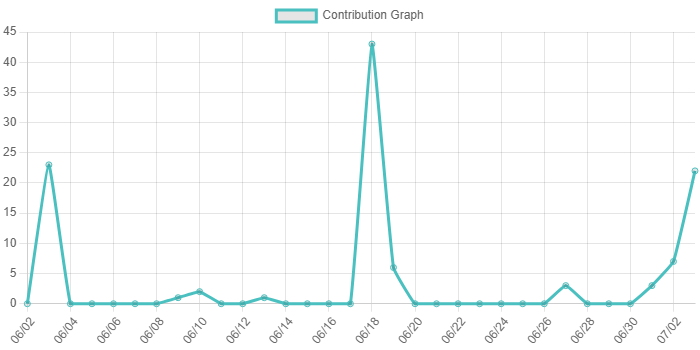

# Contribution Graph Action
> Github action for generating a contribution graph for your github profile!

I took inspiration from the repositories that used heroku. However, when I noticed the 
rate limiting problem I figured... how often do these stats need to be updated?

If anything... once perday... right? Alleviates potential rate-limiting! 



# Usage
I'm new to creating github actions, so bear with me. If there is an easier way of doing things please
let me know!

```yaml
# run every day at midnight
on:
   schedule:
     - cron: "0 0 * * *"
```

```yaml
# this will generate the contribution graph into an 'images' folder
- uses: JBraunsmaJr/contributiongraph@master
  with:
     token: ${{ secrets.GRAPH_QL }}
     viewby: day
     farback: 31
     owner: ${{ github.repository_owner }}

# simply update anything within the images folder that got updated...
- uses: stefanzweifel/git-auto-commit-action@v4
  with:
    commit_message: Updating Contribution Graph
    file_pattern: images/*
```

### Parameter Info


### token
This needs to follow github's [requirements](https://docs.github.com/en/graphql/guides/forming-calls-with-graphql) for accessing the GraphQL api.
Then stored as a `secret` in your repository

----

### viewby

| Value | Description |
| --- | --- |
| day | the graph displays contributions by day |
| week | the graph displays contributions by week |
| month | the graph displays contributions by month |

----

### farback
This behavior is tied to the `viewby` parameter. 

For instance: 
> farback: 12
> 
> viewby: week

This means 12 weeks back from today.

Similarly if `viewby` was set to days, it'd be 12 days back from today.

The only limitation is that Github limits the query to be less than 1 year.

### title
The text to appear at the top of the graph

### owner
This is boilerplate at the moment. However, this should be your username 
/ github owner as seen in the template